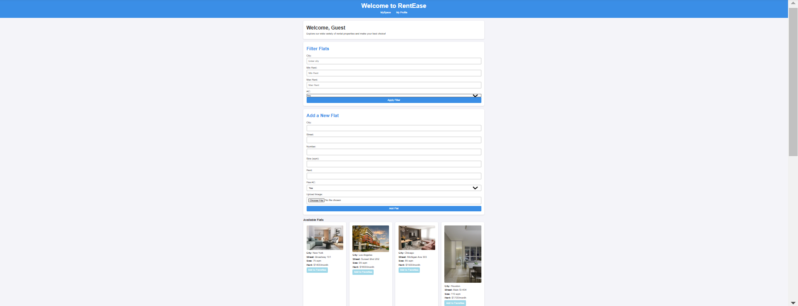
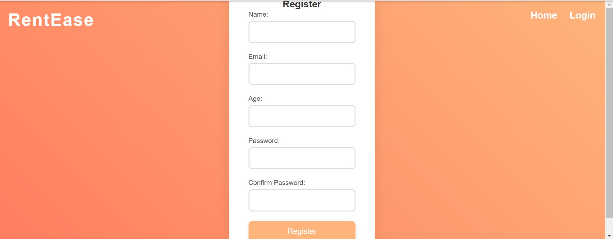
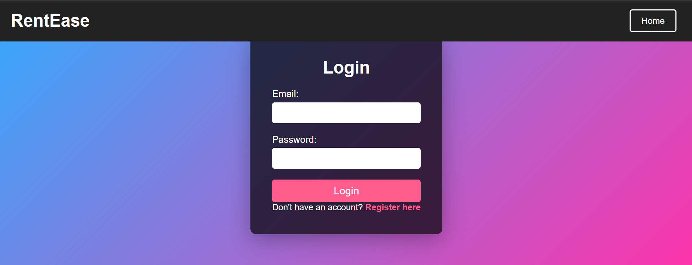
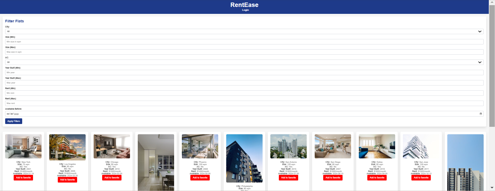

# RentEase - Flat Rental Website

## Overview
RentEase is a web application designed to help users find and list rental flats easily. The website provides features for browsing available flats, filtering listings, adding new flats, and managing a personalized dashboard.

## Features
- **User Authentication**: Users can register and log in to access personalized features.
- **Browse Listings**: Users can view available flats with images and details.
- **Filter Options**: Search for flats based on criteria such as price, location, and size.
- **Add New Flats**: Landlords can list their properties by uploading images and descriptions.
- **User Dashboard**: Personalized space to manage listed flats and favorites.

## Project Structure
```
Rentease-app/
├── homeworkproject/
│   ├── dashboard.html  # User dashboard page
│   ├── login.html      # User login page
│   ├── register.html   # User registration page
│   ├── flat1.png       # Example flat image
│   ├── flat2.png       # Example flat image
│   ├── ...
│   ├── styles.css      # Main CSS file
│   ├── script.js       # JavaScript functionality
│   ├── index.html      # Homepage
```

## Installation & Usage
1. **Clone the Repository**:
   ```sh
   git clone https://github.com/yourusername/Rentease-app.git
   ```
2. **Open in Browser**:
   - Navigate to the `Rentease` folder.
   - Open `index.html` in any modern web browser.

## Technologies Used
- **HTML, CSS, JavaScript** for front-end development.
- **Image assets** to visually represent the listed flats.

## Screenshots
The `/images` folder contains visual previews of the website, showing available flats and different features.





## Contributing
If you’d like to contribute, feel free to fork the repository and submit a pull request.

## License
This project is open-source under the MIT License.


